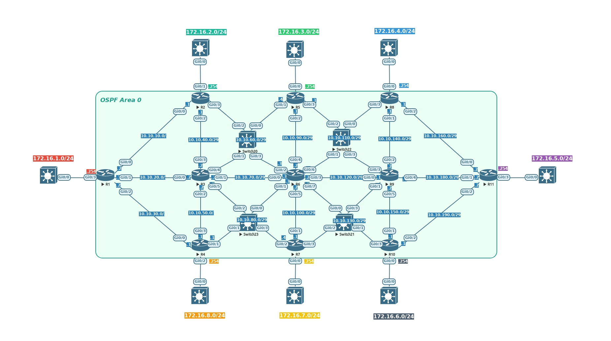

# FCSC 2023 Baleine sous graviers

Les analystes de sécurité d'un opérateur télécom font face à un problème majeur. 
Depuis quelques jours, une alerte sur leur système de détection d'intrusion ne 
cesse d'être levée par leur sonde d'analyse comportementale. La sonde indique 
que le trafic capturé sur certains liens du cœur de réseau est anormal.

Voici la topologie du réseau cœur de l'opérateur :


près plusieurs nuits passées à analyser le trafic, nos analystes n'ont pas réussi 
à trouver la cause de cette alerte.

Pourriez-vous les aider à identifier la cause de ce trafic anormal à partir d'un 
ensemble de fichiers ```pcap``` contenant le trafic capturé sur les interfaces des 
routeurs du cœur de réseau ?

Note : Le fichier ```r10_gi00.pcap``` est manquant dans l'archive, mais la résolution 
ne dépend pas de cette capture.

Fichiers:
- [baleine-sous-graviers.tar.xz](https://hackropole.fr/filer/fcsc2023-forensics-baleine-sous-graviers/public_filer/baleine-sous-graviers.tar.xz)


Auteur : Ludo


Origine : [Baleine sous graviers](https://hackropole.fr/fr/challenges/forensics/fcsc2023-forensics-baleine-sous-graviers/)


-----------


## Installation manuel
Vous n'utilisez pas l'application **les CTFs de Cyrhades** ? C'est dommage !
Mais voici comment installer ce CTF manuellement :

> git clone https://github.com/Hack-Oeil/fcsc2023-forensics-baleine-sous-graviers.git

> cd fcsc2023-forensics-baleine-sous-graviers


-----------


## Sur le site officiel hackropole.fr
> https://hackropole.fr/fr/challenges/forensics/fcsc2023-forensics-baleine-sous-graviers/